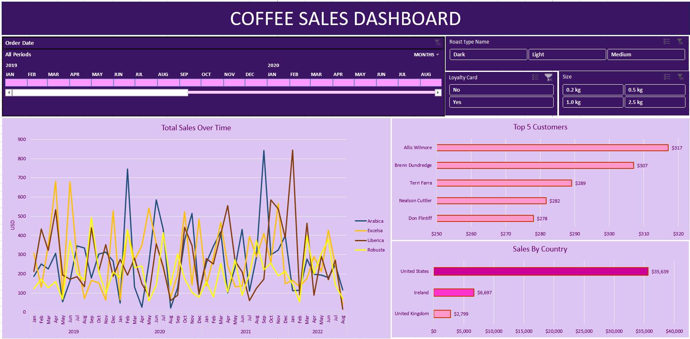

# Coffee Sales Dashboard

This project is an interactive **Coffee Sales Dashboard** built in Excel, designed to analyze and visualize sales data efficiently. It utilizes advanced Excel features such as **XLOOKUP**, **INDEX MATCH**, **Pivot Tables**, and **Pivot Charts** to provide insights into sales trends, product performance, and key business indicators.

## Project Features

### 1. XLOOKUP and INDEX MATCH
- **XLOOKUP** is used to dynamically retrieve data across large datasets, replacing the older VLOOKUP function for better flexibility.
- **INDEX MATCH** is used for more complex lookups, providing accurate data retrieval based on multiple conditions.

### 2. Pivot Tables and Pivot Charts
- **Pivot Tables** are used to summarize data for quick analysis, allowing users to view key sales metrics such as total sales, units sold, and sales by product category.
- **Pivot Charts** visually represent this data, making it easier to spot trends and compare different product lines or time periods.

### 3. Data Formatting
- The data is professionally formatted for clarity and ease of use. Conditional formatting is applied to highlight important metrics and trends.
  
### 4. Dashboard Building
- A comprehensive and user-friendly dashboard is built using Excel’s native charting tools. It integrates multiple charts, tables, and slicers for an interactive experience, allowing users to filter data by categories such as region, product, or time period.

## Key Insights
- Analyze coffee sales by product, region, and time period.
- Identify top-performing products and regions.
- Visualize sales trends with dynamic charts and graphs.

## Tools and Technologies
- **Microsoft Excel**
  - XLOOKUP
  - INDEX MATCH
  - Pivot Tables & Pivot Charts
  - Data Formatting
  - Dashboard Building

## Dashboard

### Coffee Sales Dashboard

*The Coffee Sales Dashboard offers an interactive view of key sales metrics, showcasing Pivot Charts, product performance, and regional sales breakdowns. It features slicers for dynamic filtering, with clear formatting for easy insights.*

## Conclusion
This project demonstrates the power of Excel for data analysis and visualization, providing business users with a clear, interactive way to assess sales performance in the coffee industry. The dashboard can be customized for other datasets as well.

